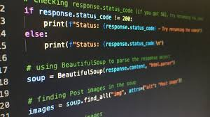

# projeto-27.02
MARCO: 
Estou começando a aprender Python e estou achando bem interessante. Estou aprendendo a usar variáveis ex: (int, float, string), também vimos condicionais (if, elif, e else),  and e or 
e o significado do símbolos (= igual, > maior , < menor, <= maior igual, <= menor igual).

ALEXANDRE: 
Estamos fazendo um projeto sobre "FURBY", criamos um esboço e tudo totalmente do zero, e  estamos fazendo um sistema para configurar o furby criado por nós, com as características de nossa preferência,
como por exemplo botão para ele falar, mandar tchau, para acender e andar para frente e para trás e lados 

CALU: 
Aprendemos como a mecher no github, criar um repositório, salvar arquivos no Vs code, tivemos que abaixar github desktop para que fosse possível salva o arquivo. Nas primeiras aulas vimos um pouco
sobre HTML.

BARRETO:
Criamos diagramas de caso de uso e também  estamos fazendo leitura de materias 

